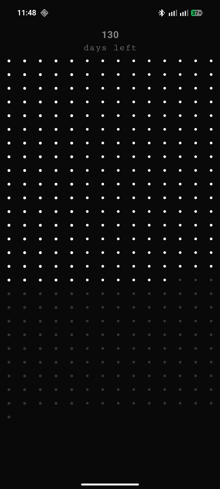
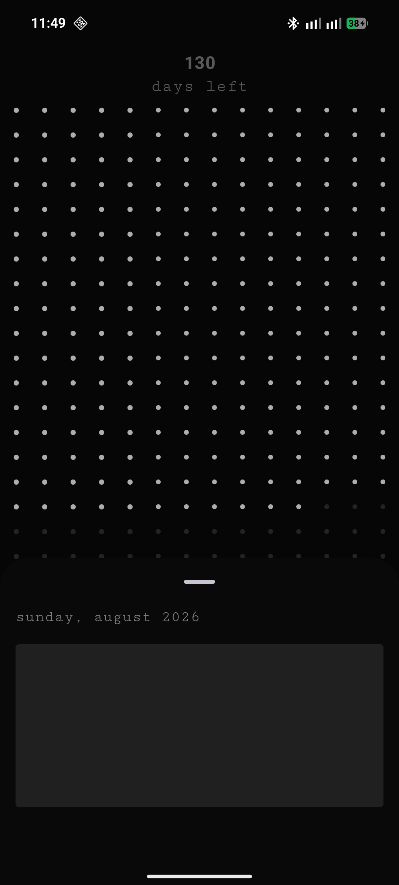
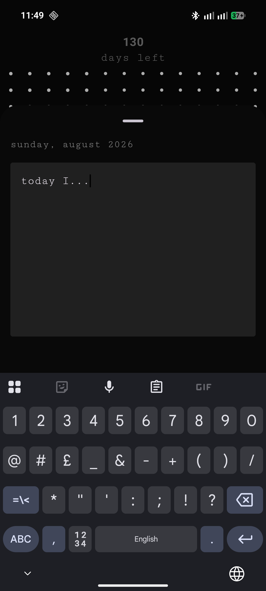

# DaysOfTheYear

DaysOfTheYear is a contemplative, minimalist journaling application for Android. It focuses on the passage of time by providing a clean, visual representation of every day in the year.

## The Design Philosophy: Minimalist Dots

At the heart of the application is a **minimalist dotted grid** representing the entire year. 
- Each dot represents a single day.
- **Visual Progress**: As days pass, the dots change state, offering a visceral sense of time moving forward.
- **Dotted UI**: The grid provides a high-level, distraction-free overview of your year, turning time into a tangible, geometric landscape.
- **Micro-journaling**: Tapping a dot allows you to record a brief thought or entry for that specific day, bridging the gap between a bird's-eye view and personal moments.

## Features

- **Progress at a Glance**: Instantly see how many days are left in the year.
- **Clean Journaling**: A focused, non-intrusive bottom-sheet interface for writing daily entries.
- **Adaptive Grid**: The dotted grid automatically adjusts its layout (columns and padding) for portrait and landscape orientations to maintain its aesthetic.
- **Haptic Feedback & Interactions**: Long-press and click interactions designed for a tactile experience.
- **Local Privacy**: Your entries are stored securely on your device using a Room database.

## Tech Stack

- **UI**: [Jetpack Compose](https://developer.android.com/jetpack/compose) for a fully reactive, modern UI.
- **Theme**: Material 3 with a customized dark, high-contrast palette.
- **Dependency Injection**: [Hilt](https://developer.android.com/training/dependency-injection/hilt-android).
- **Persistence**: [Room Database](https://developer.android.com/training/data-storage/room).
- **Animations**: Lottie and Compose Animations for smooth transitions.

## Getting Started

1. **Clone the repo**: `git clone https://github.com/yourusername/DaysOfTheYear.git`
2. **Open in Android Studio**: Recommended version: Ladybug or newer.
3. **Build and Run**: Select the `app` module and run it on your device.

## Project Structure

- `data`: Database configurations, DAOs, and repository implementations.
- `domain`: Core business models (`DateEntry`) and repository abstractions.
- `presentation`: Composable screens (`DaysOfTheYearScreen`), ViewModels, and UI components like the `DaysOfTheYear` dot and the `DayOFTheYearBottomSheet`.

## Visuals

